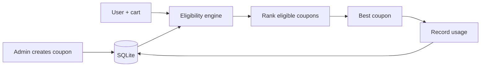
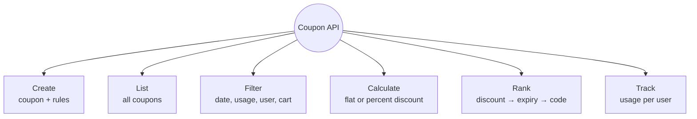
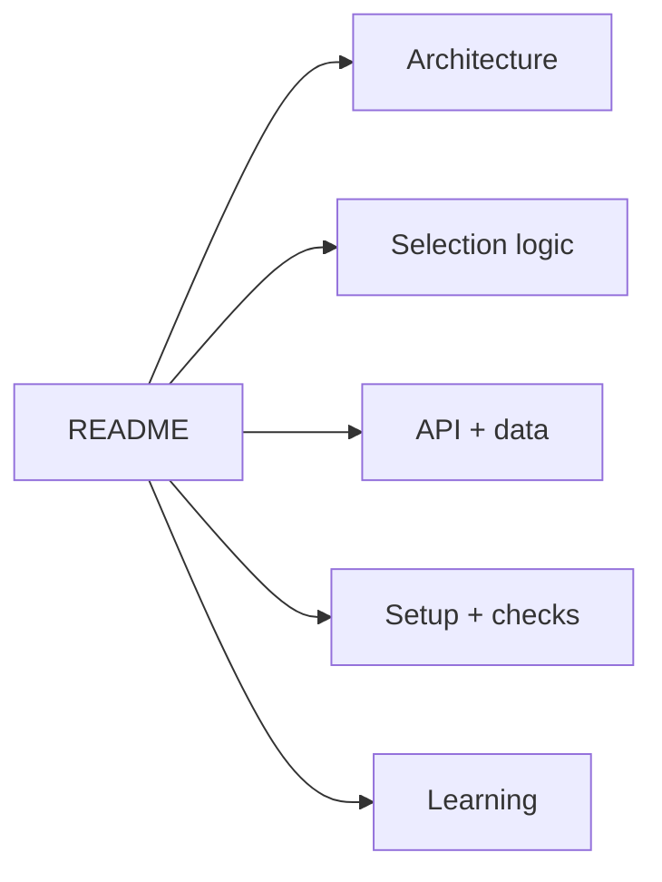
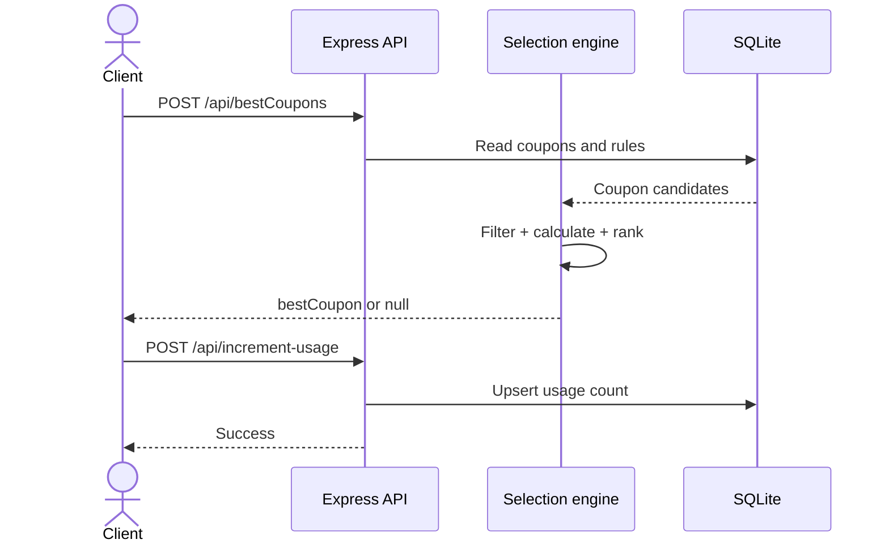
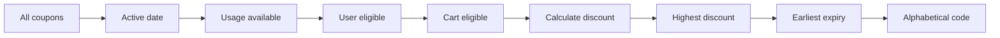
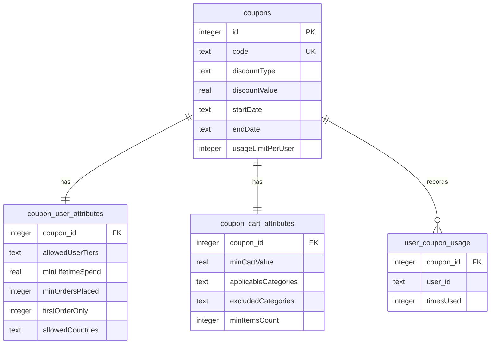
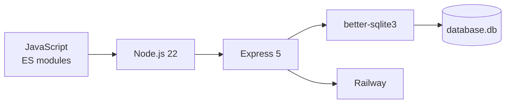

# Coupon Management API

> An Express + SQLite assignment that creates rule-based coupons, finds the best coupon for a user and cart, and tracks per-user usage.

**[Watch the demo](https://drive.google.com/file/d/1sCfaXzlHHWeB5Jyt0SMKfAYaAyWRQY6N/view?usp=sharing)** · **[Open the deployed coupon list](https://anshumat-foundation-assignment-production.up.railway.app/api/coupons)**



## What it does



## Documentation map

| Guide | Visual focus |
|---|---|
| [Architecture](docs/architecture.md) | Layers, modules, request path, and repository map |
| [Coupon selection](docs/coupon-selection.md) | Eligibility pipeline, discount formulas, and tie-breaks |
| [API and data](docs/api-and-data.md) | Endpoints, payloads, schema, and relationships |
| [Setup and verification](docs/setup-and-verification.md) | Local run, curl checks, Railway, and troubleshooting |
| [What I learned](docs/what-i-learned.md) | Design lessons, limitations, and production hardening |



## API at a glance

Base path: `/api`

| Method | Endpoint | Purpose |
|---|---|---|
| `POST` | `/createCoupon` | Create a coupon and its eligibility rules |
| `GET` | `/coupons` | List coupons with user/cart rule rows |
| `POST` | `/bestCoupons` | Return the highest-value eligible coupon |
| `POST` | `/increment-usage` | Increment one user–coupon usage counter |



> [!IMPORTANT]
> Finding a coupon does **not** reserve or consume it. The client must call `/increment-usage` separately after the coupon is actually used.

## Selection order



## Data model



## Stack



## Quick start

```bash
git clone https://github.com/SidheshwarSarangal/Anshumat-Foundation-Assignment.git
cd Anshumat-Foundation-Assignment
npm install
npm run dev
```

The API starts at `http://localhost:3000` unless `PORT` is set. `database.db` is created automatically; use `DB_FILE` to choose another path.

```bash
curl http://localhost:3000/api/coupons
```

See [Setup and verification](docs/setup-and-verification.md) for complete request examples.

## Current boundaries

| Implemented | Not currently implemented |
|---|---|
| Rule-based coupon creation | Authentication or admin authorization |
| Date, usage, user, and cart checks | Schema-validation library |
| Flat and capped-percent discounts | Transaction joining selection with redemption |
| Deterministic best-coupon ranking | Automated test suite |
| SQLite persistence | Durable Railway volume by default |

<details>
<summary><strong>Complete system view</strong></summary>

```mermaid
flowchart TB
    Client[API client]

    subgraph HTTP[Express server]
        JSON[express.json]
        Router[/api router]
    end

    subgraph Controllers[Coupon controllers]
        Create[createCoupon]
        List[getAllCoupons]
        Best[getBestCoupon]
        Usage[incrementCouponUsage]
    end

    subgraph Storage[SQLite database.db]
        Coupons[(coupons)]
        UserRules[(coupon_user_attributes)]
        CartRules[(coupon_cart_attributes)]
        UsageRows[(user_coupon_usage)]
    end

    Client --> JSON --> Router
    Router --> Create
    Router --> List
    Router --> Best
    Router --> Usage
    Create --> Coupons
    Create --> UserRules
    Create --> CartRules
    List --> Coupons
    List --> UserRules
    List --> CartRules
    Best --> Coupons
    Best --> UserRules
    Best --> CartRules
    Best --> UsageRows
    Usage --> UsageRows
```

</details>
