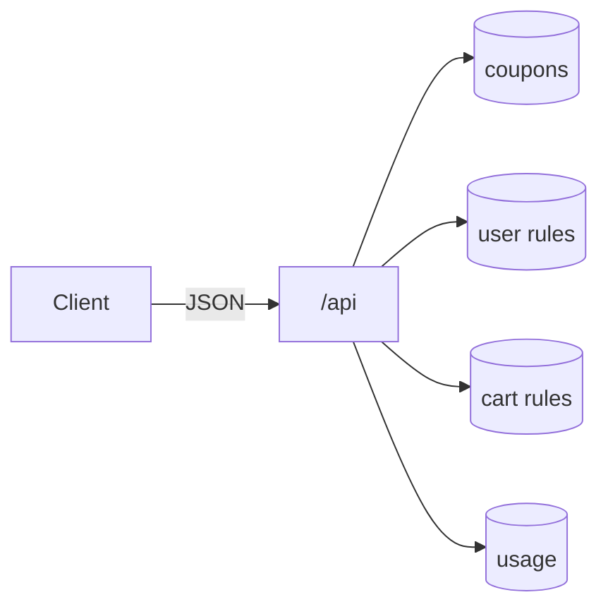
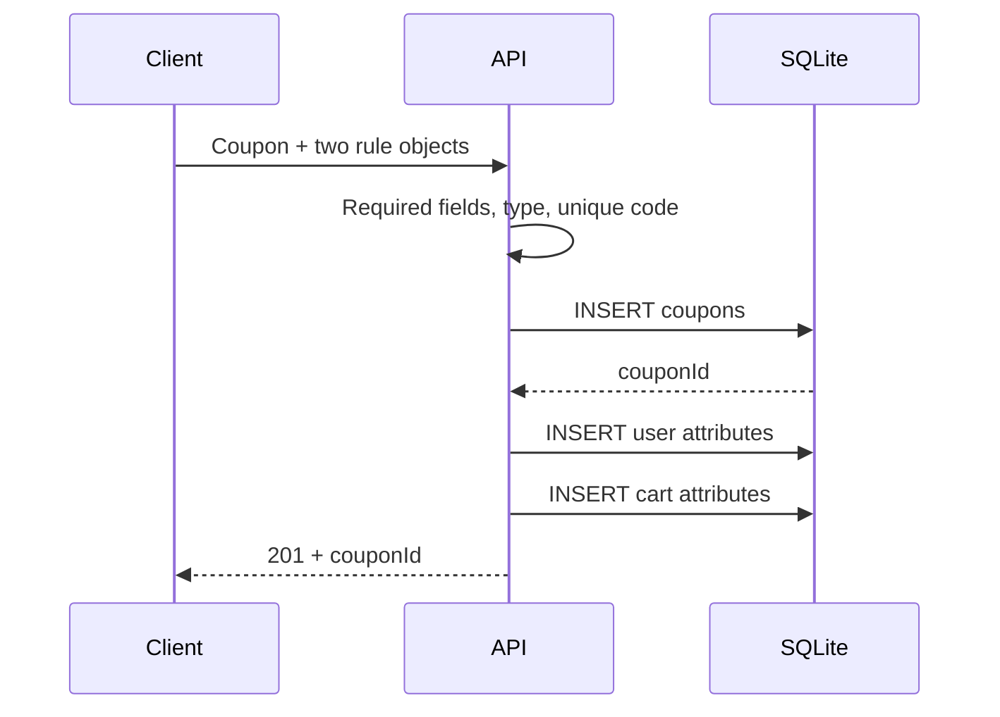
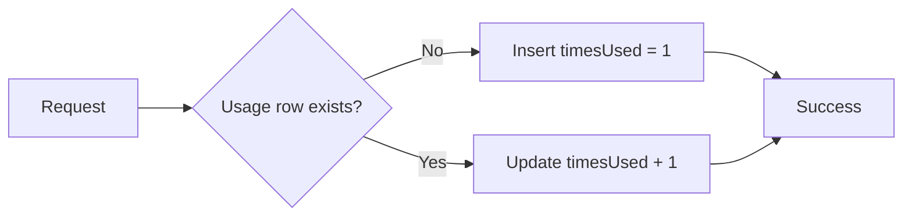
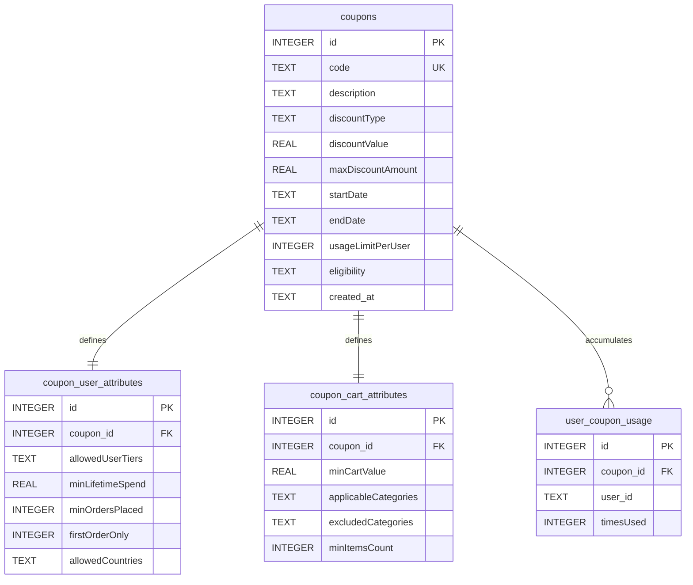

# API and data

[← README](../README.md) · [Architecture](architecture.md) · [Selection](coupon-selection.md) · [Setup](setup-and-verification.md) · [Learning](what-i-learned.md)



## Endpoint contract

| Method + path | Required input | Success |
|---|---|---|
| `POST /api/createCoupon` | Code, type, value, start, end | `201` + coupon ID |
| `GET /api/coupons` | None | `200` + coupon array |
| `POST /api/bestCoupons` | `user` + `cart.items[]` | `200` + best coupon or `null` |
| `POST /api/increment-usage` | `userId` + `couponId` | `200` + message |

## Create a coupon

```http
POST /api/createCoupon
Content-Type: application/json
```

```json
{
  "code": "REGULAR20",
  "description": "20% off selected categories",
  "discountType": "PERCENT",
  "discountValue": 20,
  "maxDiscountAmount": 500,
  "startDate": "2026-01-01",
  "endDate": "2026-12-31",
  "usageLimitPerUser": 5,
  "eligibility": {
    "allowedUserTiers": ["REGULAR", "GOLD"],
    "minLifetimeSpend": 2000,
    "minOrdersPlaced": 2,
    "firstOrderOnly": false,
    "allowedCountries": ["IN"]
  },
  "cartEligibility": {
    "minCartValue": 500,
    "applicableCategories": ["electronics", "fashion"],
    "excludedCategories": [],
    "minItemsCount": 1
  }
}
```

```json
{
  "message": "Coupon created successfully",
  "couponId": 1
}
```



## Find the best coupon

`userId` is needed when a coupon has a usage limit.

```json
{
  "user": {
    "userId": "user-42",
    "userTier": "REGULAR",
    "country": "IN",
    "lifetimeSpend": 2500,
    "ordersPlaced": 3
  },
  "cart": {
    "items": [
      {
        "id": 1,
        "name": "Smartphone",
        "unitPrice": 15000,
        "quantity": 1,
        "category": "electronics"
      },
      {
        "id": 2,
        "name": "T-Shirt",
        "unitPrice": 800,
        "quantity": 2,
        "category": "fashion"
      }
    ]
  }
}
```

```json
{
  "bestCoupon": {
    "id": 1,
    "code": "REGULAR20",
    "discount": 500
  }
}
```

No match:

```json
{
  "bestCoupon": null,
  "discount": 0
}
```

## Record usage

```json
{
  "userId": "user-42",
  "couponId": 1
}
```



## Relational model



## Storage choices

| Shape | Stored as |
|---|---|
| Coupon identity and discount | Typed columns in `coupons` |
| Complete user eligibility backup | JSON text in `coupons.eligibility` |
| Query-time user rules | Columns in `coupon_user_attributes` |
| Query-time cart rules | Columns in `coupon_cart_attributes` |
| Tier, country, category lists | JSON arrays serialized into `TEXT` |
| Boolean `firstOrderOnly` | SQLite integer `1` / `0` |
| One user's coupon count | Unique `(coupon_id, user_id)` row |

## Error map

| Status | Current trigger |
|---|---|
| `400` | Missing create fields, invalid discount type, duplicate code, invalid best-coupon shape, or missing usage IDs |
| `500` | Database/JSON/runtime error caught by a controller |

> [!CAUTION]
> The API performs basic checks only. It does not currently reject negative prices/quantities, invalid date ranges, unknown coupon IDs during usage increment, or extra fields.
