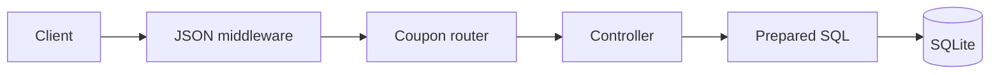
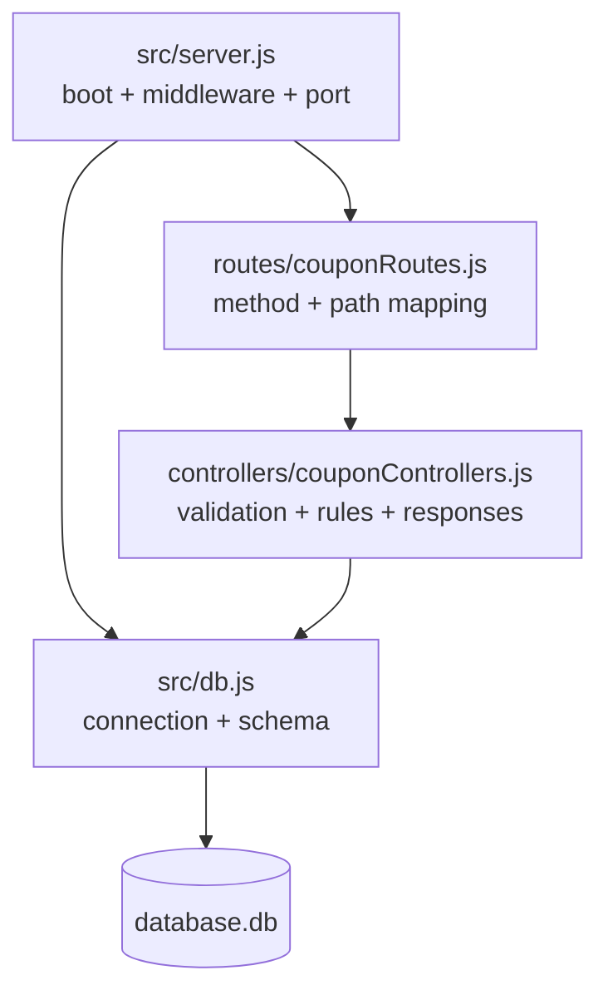
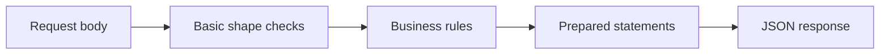
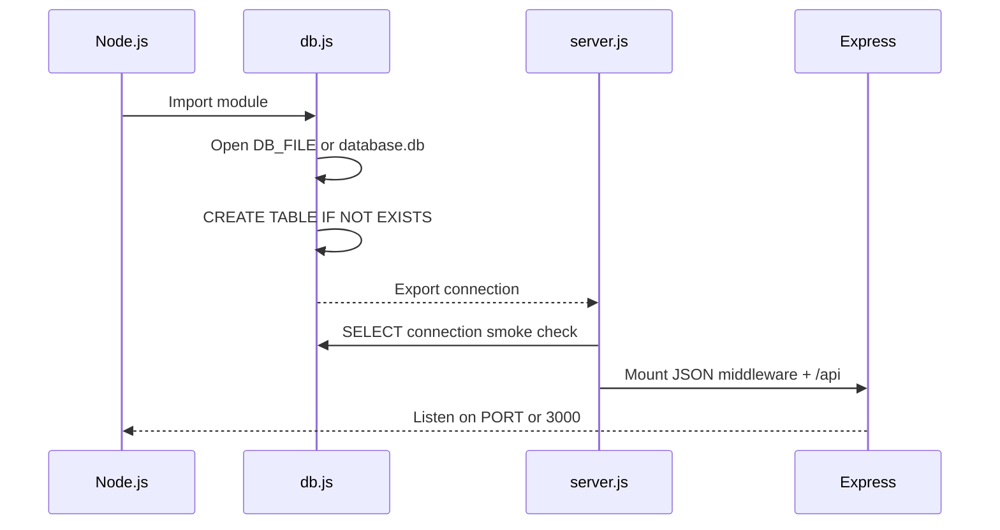
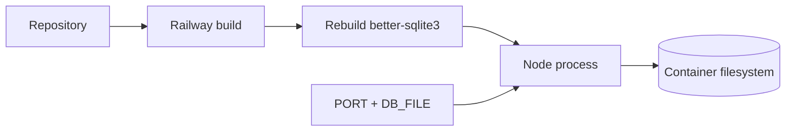

# Architecture

[← README](../README.md) · [Selection](coupon-selection.md) · [API and data](api-and-data.md) · [Setup](setup-and-verification.md) · [Learning](what-i-learned.md)

The project is a small synchronous HTTP API: Express routes call controller functions, and controllers query a local SQLite file through `better-sqlite3`.



## Module map



| Module | Owns |
|---|---|
| `src/server.js` | Environment loading, JSON parsing, database smoke query, `/api` mount, HTTP listener |
| `routes/couponRoutes.js` | Four endpoint mappings |
| `controllers/couponControllers.js` | Request checks, SQL operations, eligibility, discount calculation, ranking |
| `src/db.js` | SQLite connection and idempotent table creation |

## Request paths

```mermaid
flowchart TB
    API[/api]
    API --> CC[POST /createCoupon]
    API --> GC[GET /coupons]
    API --> BC[POST /bestCoupons]
    API --> IU[POST /increment-usage]

    CC --> C1[Insert coupon]
    C1 --> C2[Insert user rules]
    C2 --> C3[Insert cart rules]

    GC --> G1[Read coupons]
    G1 --> G2[Attach two rule rows]

    BC --> B1[Read candidates]
    B1 --> B2[Filter + rank]

    IU --> I1[Upsert usage counter]
```

## Controller responsibility



All controller work is synchronous. This fits `better-sqlite3` and keeps the implementation direct, but expensive selection loops block the Node.js event loop while they run.

## Boot sequence



## Repository map

```text
Assignment-Anshumat-Foundation/
├── controllers/
│   └── couponControllers.js
├── docs/
│   ├── api-and-data.md
│   ├── architecture.md
│   ├── coupon-selection.md
│   ├── setup-and-verification.md
│   └── what-i-learned.md
├── routes/
│   └── couponRoutes.js
├── src/
│   ├── db.js
│   └── server.js
├── package.json
└── README.md
```

## Deployment boundary



The `postinstall` script rebuilds the native SQLite binding. Without a persistent Railway volume, the database file can be replaced when the service is redeployed or restarted on new storage.
