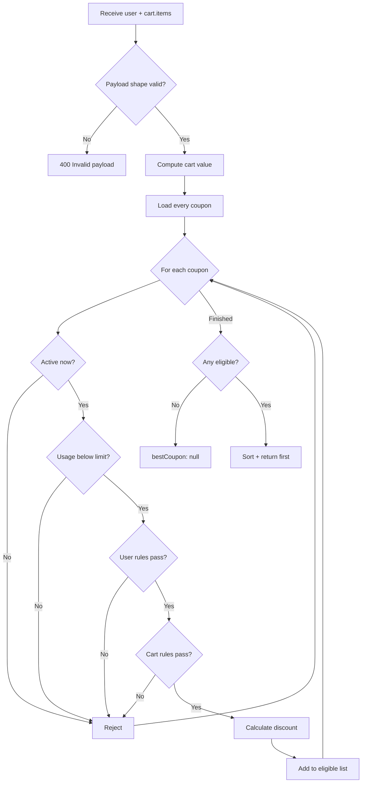
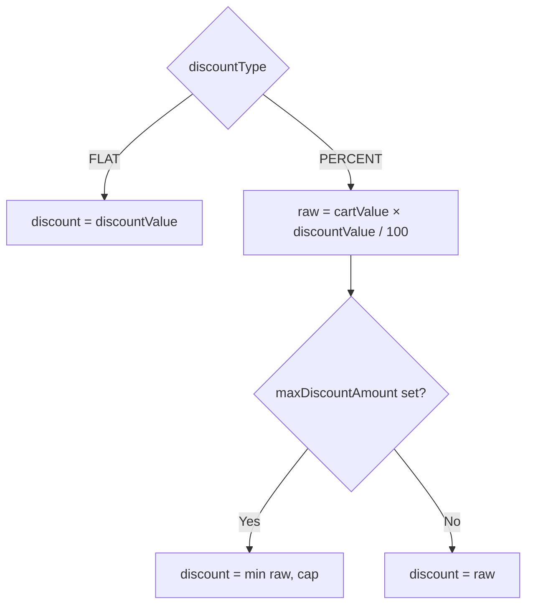
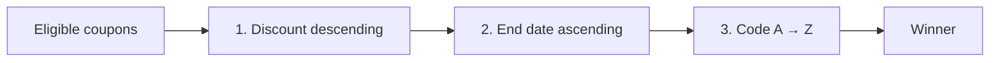
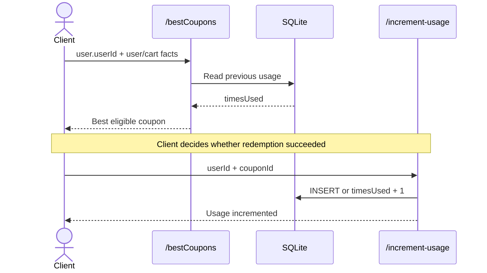

# Coupon selection

[← README](../README.md) · [Architecture](architecture.md) · [API and data](api-and-data.md) · [Setup](setup-and-verification.md) · [Learning](what-i-learned.md)

`POST /api/bestCoupons` applies a rejection pipeline, calculates savings for every survivor, then sorts the survivors deterministically.



## 1. Cart totals

```text
cartValue = Σ(unitPrice × quantity)
itemCount = Σ(quantity)
```

Both values use the submitted cart items; product prices are not verified against a server-owned catalog.

## 2. Eligibility gates

```mermaid
flowchart LR
    C[Coupon] --> D[Date]
    D --> U[Usage]
    U --> T[Tier]
    T --> CO[Country]
    CO --> LS[Lifetime spend]
    LS --> O[Orders placed]
    O --> FO[First order]
    FO --> CV[Cart value]
    CV --> AC[Allowed category]
    AC --> EX[Excluded category]
    EX --> IC[Item count]
    IC --> OK[Eligible]
```



| Gate | Pass condition |
|---|---|
| Date | Current time is between `startDate` and `endDate`, inclusive |
| Usage | Stored `timesUsed` is below `usageLimitPerUser` |
| Tier | `userTier` appears in `allowedUserTiers` |
| Country | `country` appears in `allowedCountries` |
| Spend | `lifetimeSpend ≥ minLifetimeSpend` |
| Orders | `ordersPlaced ≥ minOrdersPlaced` |
| First order | `ordersPlaced` is `0` when enabled |
| Cart value | Calculated value meets `minCartValue` |
| Applicable category | At least one cart category is allowed |
| Excluded category | No cart category is excluded |
| Item count | Total quantity meets `minItemsCount` |

Missing/empty optional rules generally behave as “no restriction.”

## 3. Discount calculation



Example for a ₹1,600 cart:

| Coupon | Calculation | Discount |
|---|---:|---:|
| `SAVE200` | Flat ₹200 | ₹200 |
| `SAVE20` | 20% × ₹1,600 | ₹320 |
| `CAPPED20` | min(₹320, ₹250) | ₹250 |

## 4. Ranking



The earliest-expiring coupon wins equal discounts; alphabetical code is the final tie-breaker.

## Usage lifecycle



> [!NOTE]
> Selection and increment are separate requests and are not wrapped in one transaction. Concurrent redemptions can therefore pass the same usage check before either increment is recorded.
