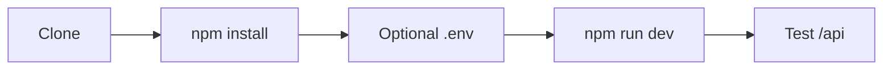
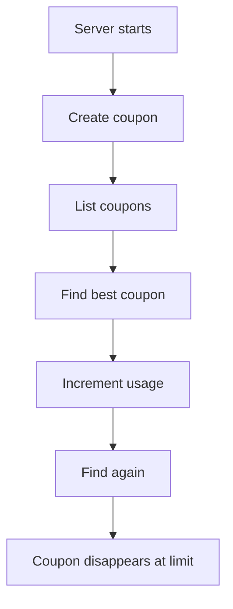
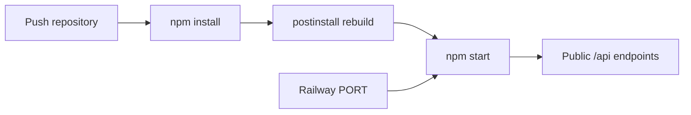

# Setup and verification

[← README](../README.md) · [Architecture](architecture.md) · [Selection](coupon-selection.md) · [API and data](api-and-data.md) · [Learning](what-i-learned.md)



## Requirements

- Node.js `22.x`
- npm
- A compiler toolchain if a prebuilt `better-sqlite3` binary is unavailable

## Local run

```bash
git clone https://github.com/SidheshwarSarangal/Anshumat-Foundation-Assignment.git
cd Anshumat-Foundation-Assignment
npm install
npm run dev
```

Default URL: `http://localhost:3000`

Optional `.env`:

```bash
PORT=3000
DB_FILE=./database.db
```

| Command | Purpose |
|---|---|
| `npm run dev` | Start with Nodemon reloads |
| `npm start` | Start with Node.js |
| `npm run postinstall` | Rebuild the native SQLite package |

## Fast verification



### 1. Create

```bash
curl -X POST http://localhost:3000/api/createCoupon \
  -H 'Content-Type: application/json' \
  -d '{
    "code":"WELCOME100",
    "description":"Flat discount for a first order",
    "discountType":"FLAT",
    "discountValue":100,
    "startDate":"2026-01-01",
    "endDate":"2026-12-31",
    "usageLimitPerUser":1,
    "eligibility":{"firstOrderOnly":true,"allowedCountries":["IN"]},
    "cartEligibility":{"minCartValue":500,"minItemsCount":1}
  }'
```

### 2. List

```bash
curl http://localhost:3000/api/coupons
```

### 3. Select

```bash
curl -X POST http://localhost:3000/api/bestCoupons \
  -H 'Content-Type: application/json' \
  -d '{
    "user":{
      "userId":"demo-user",
      "userTier":"REGULAR",
      "country":"IN",
      "lifetimeSpend":0,
      "ordersPlaced":0
    },
    "cart":{"items":[{
      "id":1,
      "name":"Backpack",
      "unitPrice":900,
      "quantity":1,
      "category":"fashion"
    }]}
  }'
```

### 4. Consume

Use the `couponId` returned by create/select:

```bash
curl -X POST http://localhost:3000/api/increment-usage \
  -H 'Content-Type: application/json' \
  -d '{"userId":"demo-user","couponId":1}'
```

## Test matrix

| Case | Expected |
|---|---|
| Missing required create field | `400` |
| Duplicate coupon code | `400` |
| Unsupported discount type | `400` |
| Coupon outside date window | Skipped |
| User at usage limit | Skipped |
| Tier/country/spend/order mismatch | Skipped |
| Cart below value/item minimum | Skipped |
| Applicable category absent | Skipped |
| Excluded category present | Skipped |
| Equal discounts | Earlier end date, then alphabetical code |
| No eligible coupon | `bestCoupon: null`, discount `0` |

## Railway



Deployed base URL:

```text
https://anshumat-foundation-assignment-production.up.railway.app
```

Replace `http://localhost:3000` in the examples with that base URL.

> [!WARNING]
> `database.db` lives on the service filesystem unless `DB_FILE` points to a mounted persistent volume. Ephemeral deployments may lose existing coupons and usage counts.

## Troubleshooting

| Symptom | Check |
|---|---|
| Native module / ABI error | Use Node `22.x`, reinstall, and run the rebuild script |
| Railway “failed to respond” | Confirm `npm start` and the platform-provided `PORT` |
| Empty coupon list after deploy | Check whether the SQLite file was recreated |
| `Internal server error` during selection | Validate serialized rule arrays and request number/date values |
| Usage limit seems ignored | Include the same `user.userId` used by `/increment-usage` |

## Verification scope

No automated test script is configured in `package.json`. Verification is currently manual through an API client such as curl, Postman, or Thunder Client.
