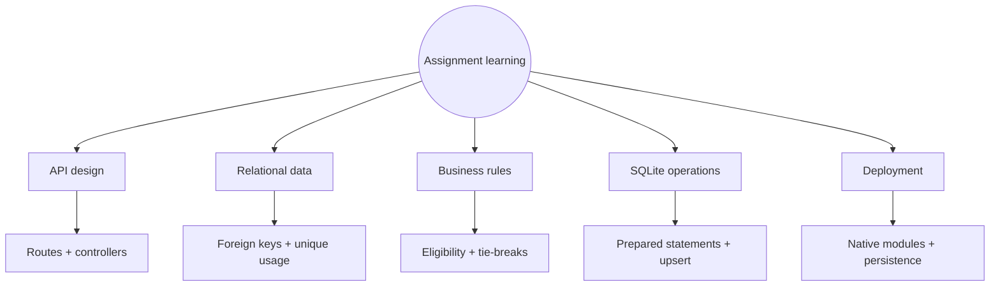
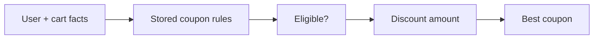
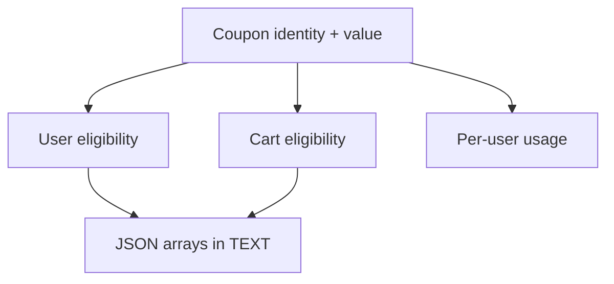
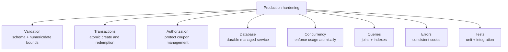
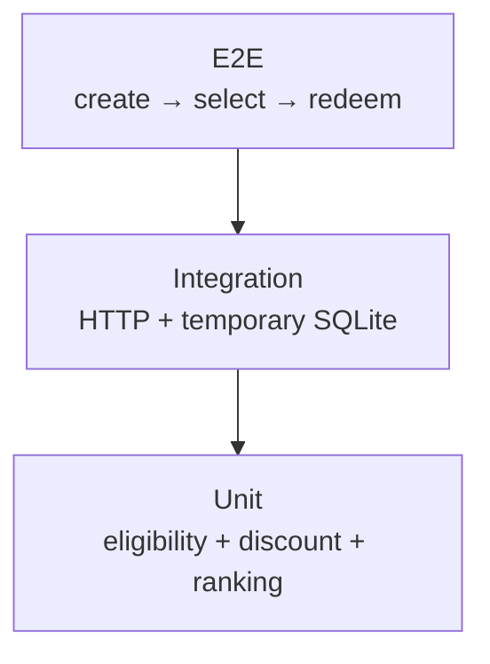

# What I learned

[← README](../README.md) · [Architecture](architecture.md) · [Selection](coupon-selection.md) · [API and data](api-and-data.md) · [Setup](setup-and-verification.md)

## Main lessons

| Lesson | Why it matters |
|---|---|
| Separate routes from controllers | HTTP mapping stays easy to scan while rules remain testable units |
| Normalize rule groups | Coupon, user, cart, and usage concerns have clear storage boundaries |
| Use prepared statements | Values are bound separately from SQL text |
| Make ranking deterministic | Equal discounts always produce the same winner |
| Use a composite uniqueness rule | One `(coupon, user)` pair has one counter |
| Use an upsert | First use and later increments share one SQL operation |
| Pin the Node.js version | Native modules must match the runtime ABI |
| Plan database durability | A file database is only durable when its filesystem is durable |

## Business-rule pipeline

Keeping “eligible?” separate from “how much?” makes the selection logic easier to reason about. Adding explicit tie-breakers removes accidental dependence on database row order.

## Data-model lesson

The hybrid model is convenient for an assignment: scalar rules are columns, while variable-length lists are JSON text. At larger scale, searchable tiers/countries/categories could become child tables or native JSON columns in a database that supports indexing them.

## Current → production

| Current implementation | Stronger production direction |
|---|---|
| Basic truthy checks | Validate complete payloads with explicit schemas |
| Three separate create inserts | Wrap coupon + rule inserts in one transaction |
| Select, then manually increment | Redeem atomically and enforce the usage limit in the database operation |
| Client-supplied prices | Load authoritative product prices server-side |
| Full coupon scan with per-row queries | Join/filter in SQL and add indexes after measuring |
| JSON arrays in text | Validate on write; normalize fields that need querying |
| Public management endpoints | Authenticate and authorize admin operations |
| File-backed deployment | Attach a persistent volume or use a managed database |
| Generic `500` responses | Log safely and return stable error codes |
| Manual API checks | Add calculation units and endpoint integration tests |

## Recommended test pyramid

Highest-value first tests:

1. Every eligibility gate at its boundary.
2. Flat, percent, and capped-percent calculations.
3. Discount, expiry, and code tie-breaks.
4. Usage-limit behavior for multiple users.
5. Rollback when any create step fails.

## AI-assisted work recorded in the original assignment

AI was used to understand Railway/native SQLite failures, reason about schema and best-coupon logic, debug deployment behavior, and improve README presentation. The engineering lesson is to verify generated advice against runtime logs, package versions, database constraints, and actual API responses.
